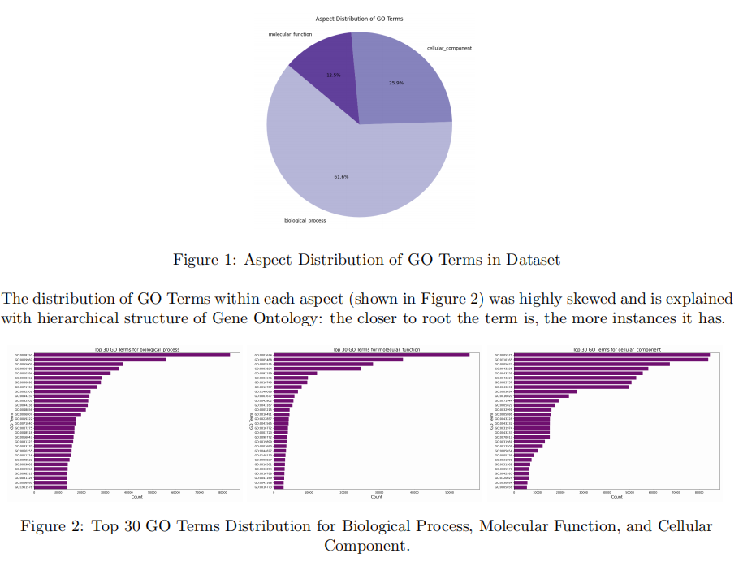
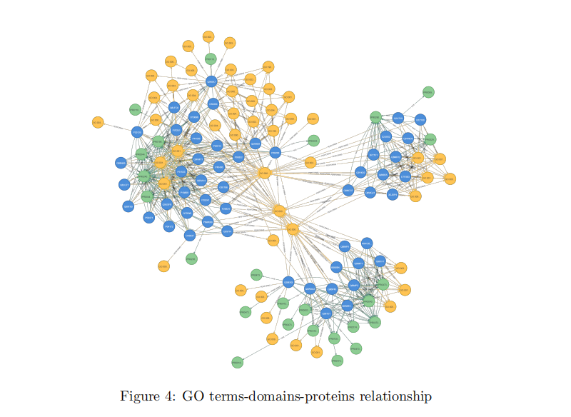

# go-terms-prediction-
# Protein Function Prediction Project

**Date:** February 23, 2025  

## Table of Contents  
1. [Introduction](#introduction)  
   - [Dataset Overview](#dataset-overview)  
2. [Dataset Pre-Processing](#dataset-pre-processing)  
   - [Embeddings](#embeddings)  
   - [Domain Data Preparation](#domain-data-preparation)  
3. [Non-Machine Learning Approaches](#non-machine-learning-approaches)  
   - [Homology-based Transfer](#homology-based-transfer)  
   - [Graph-based Exploration and Link Prediction](#graph-based-exploration-and-link-prediction)  
4. [Machine Learning Approach](#machine-learning-approach)  
   - [Model Architecture](#model-architecture)  
   - [Model Performance](#model-performance)  
   - [Other Experiments](#other-experiments)  
5. [Conclusion](#conclusion)  

---

## Introduction  
This project aims to develop a software model capable of surpassing the baseline **CAFA classifier** in predicting **protein functions** using **Gene Ontology (GO) terms**. Accurate protein function prediction without lab experiments helps reduce **cost** and **time consumption** through automation.  

### Dataset Overview  
The dataset consists of **4,277,047 protein-GO term pairs** across three primary aspects:  
- **Biological Process**  
- **Molecular Function**  
- **Cellular Component**  

The dataset exhibits a **hierarchical structure**, where GO terms closer to the root have higher instance counts.




---

## Dataset Pre-Processing  
The dataset was split into three separate subsets, one for each GO aspect.  

### Embeddings  
Embeddings from `train_embeddings.h5` were integrated into the dataframe, and **L2 normalization** was applied.  

### Domain Data Preparation  
Domain data from `train_protein2ipr.dat` was processed using **TensorFlow’s Tokenizer** and **pad_sequences** functions to create uniform-length arrays suitable for machine learning models.

---

## Non-Machine Learning Approaches  

### Homology-Based Transfer  
BLAST similarity data was processed by removing self-hits and retaining **only the top 10% of matches** per protein. The confidence score for GO terms was calculated as:  
```math
weight = - \log_{10} (E-value + 10^{-200})
```
Evaluation on **2000 training proteins** yielded:  
- **Mean PR AUC:** 0.55  
- **Mean Max F1-Score:** 0.61  

### Graph-Based Exploration and Link Prediction  
A graph-based model was implemented in **Neo4j**, with nodes representing **proteins, domains, and GO terms**. The pipeline used **FastRP embeddings**, and models like logistic regression, **random forest**, and **MLP**. The **MLP performed best**, but Neo4j’s limitations prevented full evaluation with AUCPR and F1 metrics.


---

## Machine Learning Approach  

### Model Architecture  
A **Deep Neural Network (DNN)** with:
- **Three dense layers** (2000, 1500, 1500 neurons)
- **ReLU activation**
- **Batch normalization** and **dropout (30%)**
- **Adam optimizer** with **early stopping**

### Model Performance  
**Evaluation Metrics:** Hamming Loss, Precision, and Recall  

| Aspect              | Hamming Loss | Precision | Recall  |
|--------------------|--------------|------------|---------|
| Biological Process | 0.0194       | 0.6821     | 0.2654  |
| Molecular Function | 0.0074       | 0.8161     | 0.5388  |
| Cellular Component | 0.0114       | 0.8103     | 0.6342  |

Results show that **embedding-trained models** outperform **domain-trained models** in accuracy.  

### Other Experiments  
- **Graph Convolutional Networks (GCN)** were explored but had high memory demands.  
- **Autoencoders with GRU networks** were efficient but underperformed compared to CNN models.

---

## Conclusion  
- **Deep learning models** outperformed graph-based and homology-based approaches.  
- Homology-based transfer worked well for some proteins but failed for others.  
- Graph-based approaches showed promise but were limited by **Neo4j’s ML capabilities**.  
- The **final predictions** were generated using the best embedding-trained model and submitted as `embed_model_protein_predictions.csv`.  

---  
**Contributions & Feedback Welcome!** 🚀
